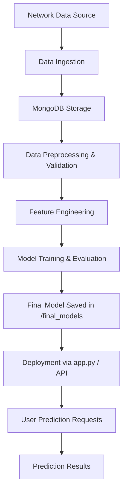

# 🔐 Network Security Project

This repository demonstrates an **end-to-end Network Security system** integrating **data ingestion, storage (MongoDB), model training, and deployment**.  

The goal is to build a modular and production-ready workflow for detecting and preventing network security threats using machine learning and database integration.

---

## 🚀 Features
- Data ingestion pipeline for network traffic  
- Data storage in **MongoDB** for scalability  
- Preprocessing & feature engineering modules  
- ML/DL models for detecting anomalies & threats  
- Model storage and management (`final_models/`)  
- API-based application (`app.py`) for predictions  
- Dockerized deployment with reproducible setup  

---

## 📂 Project Structure
```
Network_Security/
│
├── .github/workflows/ # CI/CD workflows
│
├── NetworkSecurity/ # Core source code (data processing, ML pipeline)
│
├── Network_Data/ # Dataset and raw network logs
│
├── data_schema/ # Data validation schemas
│
├── final_models/ # Trained & saved models
│
├── research/ # Jupyter notebooks for experiments/EDA
│
├── app.py # API/Streamlit app for predictions
├── main.py # Entry point for running the pipeline
├── push_data_to_mongoDB.py # Script to ingest & store data into MongoDB
├── test_mongodb.py # Tests MongoDB connectivity
│
├── Dockerfile # Containerization setup
├── requirements.txt # Dependencies
├── setup.py # Package configuration
└── README.md # Documentation
```

---

## 🔄 Workflow


## 🛠 Tools & Technologies

- Python – Core programming language

- MongoDB – NoSQL database for storing and retrieving network data

- Scikit-learn / TensorFlow / PyTorch – Model training & evaluation

- Pandas, NumPy – Data manipulation & preprocessing

- Matplotlib / Seaborn – Data visualization (research & analysis)

- Streamlit / FastAPI – Application layer for predictions

- Docker – Containerization for reproducible deployment

- GitHub Actions – CI/CD workflows

## ⚙️ Setup Instructions

### 1. Clone the repository
```
git clone https://github.com/Naveen-DS08/Network_Security.git
cd Network_Security
```
### 2. Create and activate a virtual environment
```
python -m venv venv
source venv/bin/activate   # Linux/Mac
venv\Scripts\activate      # Windows
```
### 3. Install dependencies
```
pip install -r requirements.txt
```

### 4. Start MongoDB service
- Make sure you have MongoDB installed and running locally or provide connection details in your config.

### 5. Push data into MongoDB
```
python push_data_to_mongoDB.py
```

### 6. Run the pipeline
```
python main.py
```

### 7. Run the app (Streamlit or FastAPI)
```
# Streamlit
streamlit run app.py

# OR FastAPI
uvicorn app:app --reload
```

### 8. Run tests
```
pytest test_mongodb.py
```

## 📊 Results

- Network traffic successfully ingested & stored in MongoDB

- ML models trained and saved under final_models/

- Deployed app serving predictions from trained models

## 📌 Future Improvements

- Add anomaly detection using advanced DL models (LSTMs, Autoencoders)

- Integrate real-time packet capture (e.g., Scapy, Wireshark API)

- Enhance CI/CD pipelines for automatic deployment

- Implement monitoring for model drift & performance

## 👨‍💻 Author

**Naveen Babu S**

 
